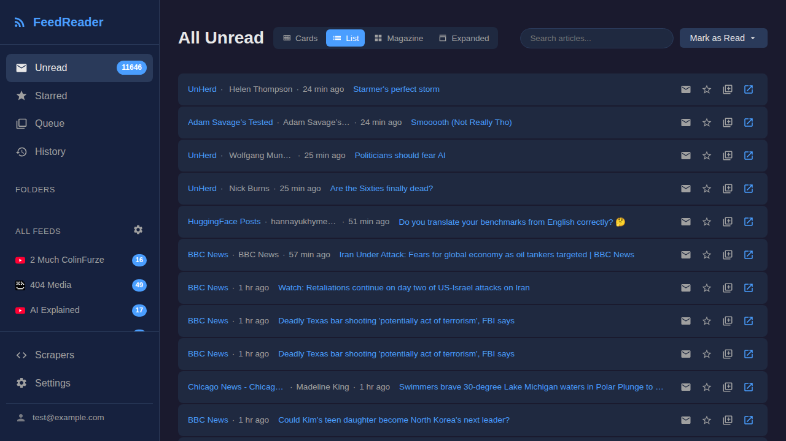

# FeedReader

A self-hosted, multi-user feed reader built with Go and SQLite. Supports
RSS/Atom feeds and custom web scrapers for sites without feeds.



## Features

- **RSS/Atom feeds** — subscribe to standard feeds with conditional GET support
- **Custom scrapers** — CSS-selector-based scrapers for sites without RSS
- **Folders & categories** — organize feeds into nested folders
- **Multiple views** — card, list, magazine, and expanded layouts
- **Reading queue** — save articles to read later
- **Reading history** — track recently read articles
- **Exclusion rules** — filter articles by keyword or author per folder
- **OPML import/export** — migrate to and from other feed readers
- **Newsletter support** — receive newsletters as feed items via webhook or built-in SMTP
- **Data retention** — automatic cleanup of old articles (starred items preserved)
- **Multi-user** — each user gets their own feeds, folders, and settings
- **Responsive UI** — works on desktop, tablet, and mobile
- **Offline support** — service worker for offline reading
- **Pluggable auth** — works with Authelia, Cloudflare Access, Tailscale, OAuth2 Proxy, or any proxy that injects identity headers
- **Docker-ready** — single-binary or Docker Compose with Caddy + Authelia for passkey auth
- **Config file** — full TOML configuration with environment variable overrides

## Quick Start

### Option A: Docker Compose (recommended)

The easiest way to run FeedReader in production. Uses Caddy as a reverse proxy
and Authelia for WebAuthn/passkey authentication.

```bash
git clone https://github.com/newscientist101/feedreader.git
cd feedreader/deploy
cp .env.example .env          # set DOMAIN=feeds.yourdomain.com
$EDITOR authelia/users_database.yml   # add your user
docker compose up -d
```

See **[DEPLOY.md](DEPLOY.md)** for the full walkthrough including domain setup,
user creation, passkey registration, and backup.

### Option B: Binary

#### Prerequisites

- Go 1.22+
- Node.js 18+ (for JS tests and linting only)

#### Build from source

```bash
git clone https://github.com/newscientist101/feedreader.git
cd feedreader

# Install JS dev dependencies (for tests/linting)
npm install

# Build the binary
make build
```

#### Create a config file

```bash
# Copy the example config and edit it
cp config.example.toml config.toml
$EDITOR config.toml
```

Minimal `config.toml` example (generic reverse proxy):

```toml
[auth]
provider = "proxy"

[auth.proxy]
user_id_header = "Remote-User"
email_header = "Remote-Email"
```

Or run the interactive setup wizard to generate a config:

```bash
./feedreader init
```

#### Run

```bash
./feedreader --config config.toml
# Listens on :8000 by default
```

The database (`db.sqlite3`) is created automatically on first run.

#### Systemd

```bash
sudo cp srv.service.example /etc/systemd/system/feedreader.service
# Edit the service file to match your paths and config
sudo systemctl daemon-reload
sudo systemctl enable --now feedreader
```

Put a reverse proxy (nginx, Caddy, etc.) in front to handle TLS and
inject authentication headers.

## Configuration

Configure via `config.toml`, CLI flags, or environment variables.
CLI flags override config file values; environment variables override both.

| Flag | Env var | Config key | Default | Description |
|---|---|---|---|---|
| `--listen` | — | `listen` | `:8000` | Listen address |
| `--db` | — | `db` | `db.sqlite3` | SQLite database path |
| `--email-domain` | — | `email_domain` | (hostname) | Email domain for newsletters |
| `--config` | `CONFIG_FILE` | — | `config.toml` | Config file path |

See **[CONFIGURATION.md](CONFIGURATION.md)** for the full configuration reference,
all auth provider options, and example configs.

## Auth Providers

FeedReader delegates authentication to a reverse proxy. The proxy authenticates
users and injects identity headers; FeedReader reads those headers to identify
the current user.

| Provider | Description |
|---|---|
| `proxy` | Generic reverse proxy headers (configurable header names) |
| `tailscale` | Tailscale Serve/Funnel identity headers |
| `cloudflare` | Cloudflare Access with JWT validation |
| `authelia` | Authelia forward auth headers |
| `oauth2_proxy` | OAuth2 Proxy forwarded headers |
| `exedev` | Legacy exe.dev platform (backward compat) |

For local development, skip auth entirely:

```bash
DEV=1 ./feedreader
```

## Newsletter

FeedReader can receive email newsletters and surface them as feed items.
Two ingestion methods are available:

### Webhook (recommended)

Send the raw RFC 822 message to the HTTP endpoint:

```
POST /api/newsletter/ingest
Authorization: Bearer <webhook_secret>
Content-Type: message/rfc822
```

Configure in `config.toml`:

```toml
[newsletter]
webhook_secret = "your-secret-here"
```

### Built-in SMTP

Point your email forwarder at the built-in SMTP server (localhost only,
no TLS, no auth — intended for local delivery):

```toml
[newsletter.smtp]
enabled = true
listen = ":2525"
```

Newsletter addresses have the form `nl-<token>@<email_domain>`.
Generate an address in the app: **Settings → Newsletter**.

## Tech Stack

- **Go** standard library `net/http` router — no web framework
- **SQLite** via [modernc.org/sqlite](https://pkg.go.dev/modernc.org/sqlite) (pure Go, no CGO)
- **sqlc** for type-safe SQL queries
- **Server-rendered HTML** with `html/template`
- **Vanilla JS** frontend — native ES modules, no bundler, no framework
- **goquery** for CSS-selector scraping

## Project Structure

```
cmd/srv/main.go            Entry point
srv/
  server.go                HTTP handlers
  auth.go                  Auth middleware (pluggable providers)
  auth_*.go                Auth provider implementations
  setup_page.go            First-run setup UI
  filter.go                Folder exclusion-rule filtering
  content_filter.go        Per-feed content transform filters
  category_tree.go         Nested folder tree builder
  retention.go             Data retention / cleanup
  feeds/                   RSS/Atom fetcher and parser
  scrapers/                CSS-selector and JSON API scrapers
  huggingface/             Hugging Face model feed source
  opml/                    OPML import/export
  email/                   Newsletter SMTP receiver and webhook
  templates/               Server-rendered HTML templates
  static/                  CSS, JS, icons
    app.js                 JS entry point
    modules/               ES modules (each with a .test.js companion)
    style.css              Styles
config/
  config.go                TOML config file parsing
db/
  db.go                    Database setup, migrations, pragmas
  migrations/              Numbered SQL migrations (001–015)
  queries/                 SQL queries for sqlc
  dbgen/                   Generated Go code (do not edit)
deploy/
  docker-compose.yml       Docker Compose deployment (Caddy + Authelia)
  Caddyfile                Caddy reverse proxy config
  authelia/                Authelia config templates
Dockerfile                 Multi-stage Docker build
config.example.toml        Example configuration
srv.service.example        Systemd service template
```

## Development

### Validation

Run all checks before committing:

```bash
make check
```

This runs, in order:

| Step | Command | What it does |
|---|---|---|
| Format | `make fmt-check` | Verify `goimports` formatting |
| Fix | `make fix-check` | Verify `go fix` has nothing to apply |
| Lint | `make lint` | Go (golangci-lint) + JS (eslint) + CSS (stylelint) + HTML (djlint) + template validation |
| Test | `make test` | Go tests + JS tests (vitest) |
| Vulncheck | `make vulncheck` | Scan dependencies for known vulnerabilities |

To auto-fix Go formatting: `make fmt`

### Database Migrations

Migrations in `db/migrations/` are applied automatically on startup.
Add new ones as sequentially numbered `.sql` files.

### sqlc Workflow

Edit SQL in `db/queries/*.sql`, then regenerate:

```bash
go generate ./db/...
```

## Scraper System

Scraper configs use CSS selectors to extract articles from HTML pages:

```json
{
  "itemSelector": "article.post",
  "titleSelector": "h2.title",
  "urlSelector": "a.permalink",
  "urlAttr": "href",
  "summarySelector": "p.summary",
  "authorSelector": "span.author",
  "imageSelector": "img.thumb",
  "imageAttr": "src",
  "dateSelector": "time",
  "dateAttr": "datetime",
  "baseUrl": "https://example.com"
}
```

Only `itemSelector` is required. All other selectors are optional.

## API

All endpoints require authentication headers.

<details>
<summary>Full API reference</summary>

### Feeds
- `GET /api/feeds/{id}` — feed details
- `GET /api/feeds/{id}/articles` — feed articles
- `GET /api/feeds/{id}/status` — fetch status
- `POST /api/feeds` — create feed
- `PUT /api/feeds/{id}` — update feed
- `DELETE /api/feeds/{id}` — delete feed
- `POST /api/feeds/{id}/refresh` — refresh now
- `POST /api/feeds/{id}/category` — set category
- `POST /api/feeds/{id}/read-all` — mark all read

### Articles
- `GET /api/articles/unread` — unread articles
- `POST /api/articles/{id}/read` — mark read
- `POST /api/articles/{id}/unread` — mark unread
- `POST /api/articles/{id}/star` — toggle star
- `POST /api/articles/batch-read` — batch mark read
- `POST /api/articles/read-all` — mark all read
- `GET /api/search` — search articles

### Categories
- `POST /api/categories` — create
- `PUT /api/categories/{id}` — update
- `DELETE /api/categories/{id}` — delete
- `GET /api/categories/{id}/articles` — category articles
- `POST /api/categories/reorder` — reorder
- `POST /api/categories/{id}/parent` — set parent
- `POST /api/categories/{id}/read-all` — mark all read
- `GET /api/categories/{id}/exclusions` — list exclusion rules
- `POST /api/categories/{id}/exclusions` — create rule
- `DELETE /api/exclusions/{id}` — delete rule

### Queue & History
- `GET /api/queue` — list queued articles
- `POST /api/articles/{id}/queue` — toggle queue
- `DELETE /api/articles/{id}/queue` — remove from queue

### OPML
- `GET /api/opml/export` — export feeds
- `POST /api/opml/import` — import OPML file

### Scrapers
- `GET /api/scrapers/{id}` — get scraper
- `POST /api/scrapers` — create scraper
- `PUT /api/scrapers/{id}` — update scraper
- `DELETE /api/scrapers/{id}` — delete scraper

### Newsletter
- `GET /api/newsletter/address` — get address
- `POST /api/newsletter/generate-address` — generate new address
- `POST /api/newsletter/ingest` — ingest raw email (webhook)

### Settings & Counts
- `GET /api/settings` — get settings
- `PUT /api/settings` — update settings
- `GET /api/counts` — unread/starred/feed counts
- `GET /api/favicon` — fetch site favicon
- `GET /api/retention/stats` — retention statistics
- `POST /api/retention/cleanup` — run cleanup

</details>

## License

[CC0](LICENSE)
